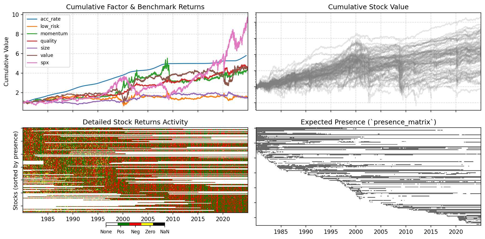

# Quantitative Momentum Strategy with Dynamic Risk Control

This repository contains a Python implementation of a long/short quantitative momentum strategy applied to the US equity market. The core of the strategy is based on the classic momentum factor defined by Jegadeesh and Titman (1993), enhanced with a dynamic risk management overlay inspired by Barroso and Santa-Clara (2015).

The entire backtesting and analysis process is contained within the provided Jupyter Notebook and supporting Python modules.

## Strategy Algorithm

The strategy is executed on a monthly basis and consists of three key components:

### 1. Factor Definition: 12-1 Momentum

On each rebalancing date (the last trading day of the month), all available stocks are ranked based on their momentum score. The score is calculated as the cumulative return over the past 12 months, excluding the most recent month (J-12 to J-1). This lag helps mitigate the short-term reversal effect.

The formula for the score of stock *i* at time *T* is:

`score_i = (Price_i,T-1m / Price_i,T-12m) - 1`

### 2. Portfolio Construction

Based on the momentum scores, a long/short portfolio is constructed from a universe of the 30 most liquid US stocks:

-   **Long Leg:** The top 20% of stocks with the highest momentum scores are selected.
-   **Short Leg:** The bottom 20% of stocks with the lowest momentum scores are selected.

The portfolio is equally weighted within each leg.

### 3. Risk Management: Volatility Targeting

A key feature of this strategy is its dynamic leverage, which adjusts based on market conditions. The goal is to target the volatility of a benchmark (S&P 500) to avoid the excessive drawdowns historically associated with momentum strategies.

The portfolio's exposure is scaled by a factor `w_scale`, calculated as:

`w_scale = min( (σ_SPX / σ_momentum), 2 )`

Where `σ` represents the estimated future monthly volatility, proxied by the realized volatility over the preceding 6 months. This mechanism reduces the strategy's exposure during periods of high momentum volatility and increases it during calm periods, up to a maximum leverage cap.

## Performance Summary

The backtesting script generates a comprehensive set of performance metrics. The following table shows an example output of the key statistics for the strategy.

| Metric                          | Value   |
| ------------------------------- | ------- |
| Annualized Return               | -0.73%  |
| Annualized Volatility           | 36.20%  |
| Annualized Sharpe Ratio         | -0.13   |
| Annualized Alpha (vs 6 factors) | -1.11%  |
| Information Ratio               | -0.04   |

## Visualizations

### Strategy Performance

The final cumulative performance of the strategy is benchmarked against the S&P 500 and a broad momentum factor.


### Risk Management Dynamics

The following charts illustrate the risk management mechanism in action, showing how the portfolio's gross leverage (exposure) changes over time in response to the underlying volatility of the momentum factor relative to the market.


### Data Overview

The data analysis dashboard provides a high-level overview of the input data, including factor performance and data availability maps for the stock universe.



## Getting Started

To replicate the results, follow these steps:

### Prerequisites

-   Python 3.10+
-   Pip & a virtual environment manager (e.g., `venv`)

### Installation & Execution

1.  **Clone the repository:**
    ```bash
    git clone https://github.com/buhbuhtig/raif-test
    cd raif-test
    ```

2.  **Create and activate a virtual environment:**
    ```bash
    python -m venv venv
    # On Windows
    venv\Scripts\activate
    # On macOS/Linux
    source venv/bin/activate
    ```

3.  **Install the required dependencies:**
    ```bash
    pip install -r requirements.txt
    ```

4.  **Run the backtest:**

    Option A: Open and run the main Jupyter Notebook (`research.ipynb`) from top to bottom. It will sequentially perform all data loading, analysis, and visualization.

    Option B: Alternatively, run the script run.py to execute the backtest logic programmatically (e.g. from terminal: python run.py).

## Dependencies

The project relies on the following major Python libraries:
-   `pandas`
-   `numpy`
-   `statsmodels`
-   `matplotlib`
-   `tqdm`
-   `pyarrow`
-   `yfinance` (for patching data)